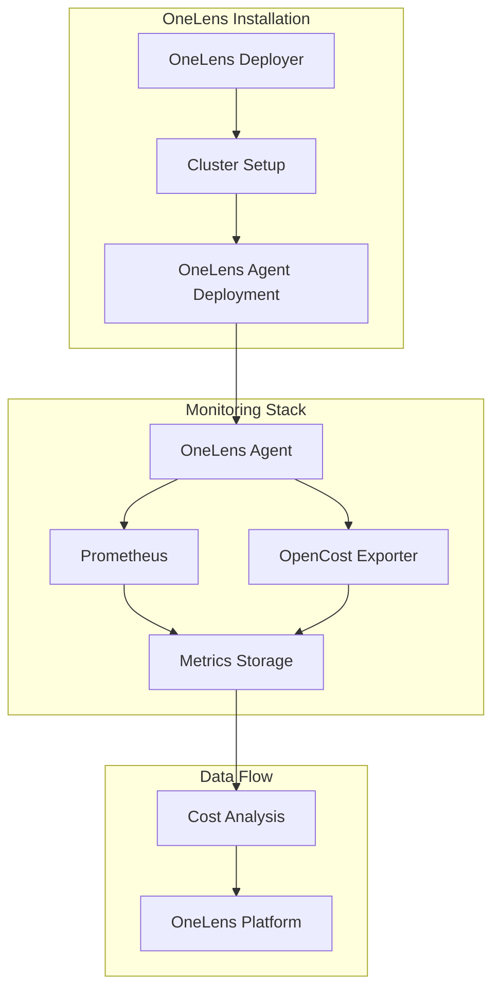

# OneLens Installation Scripts

> **Simplified Kubernetes cost optimization and monitoring deployment**

[](https://docs.onelens.cloud/integrations/kubernetes/onelens-agent/onboarding-a-k8s-cluster)
[](https://astuto-ai.github.io/onelens-installation-scripts/)
[](https://gallery.ecr.aws/w7k6q5m9/onelens-deployer)

## 📋 Overview

OneLens Installation Scripts provides automated deployment tools for setting up comprehensive Kubernetes cost monitoring and optimization infrastructure. This repository contains Helm charts and automation scripts to deploy OneLens agents and supporting monitoring stack.

## 🏗️ Components

### 🚀 OneLens Deployer
A Kubernetes job orchestrator that handles the initial setup and configuration of OneLens infrastructure in your cluster.

**Features:**
- One-time setup jobs
- Cluster configuration automation
- Cross-platform Docker images (AMD64/ARM64)

### 📊 OneLens Agent
The core monitoring agent that collects cost and resource utilization data from your Kubernetes cluster.

**Includes:**
- **OneLens Agent**: Main cost monitoring and optimization agent
- **Prometheus**: Metrics collection and storage
- **OpenCost Exporter**: Kubernetes cost metrics calculation
- **Custom Storage Classes**: Optimized storage configurations

## 🚀 Quick Start

### Prerequisites
- Kubernetes cluster (1.25+)
- Helm 3.0+
- kubectl configured for your cluster

### Installation

1. **Add the OneLens Helm repository:**
   ```bash
   helm repo add onelens https://astuto-ai.github.io/onelens-installation-scripts/
   helm repo update
   ```

2. **Deploy OneLens Deployer:**
   ```bash
   helm upgrade --install onelensdeployer onelens/onelensdeployer \
     --set job.env.CLUSTER_NAME=your-cluster-name \
     --set job.env.REGION=your-aws-region \
     --set-string job.env.ACCOUNT=your-aws-account-id \
     --set job.env.REGISTRATION_TOKEN="your-registration-token"
   ```

3. **Deploy OneLens Agent:**
   ```bash
   helm upgrade --install onelens-agent onelens/onelens-agent \
     --namespace onelens-system \
     --create-namespace
   ```

### Configuration

#### OneLens Deployer Configuration
| Parameter | Description | Default |
|-----------|-------------|---------|
| `job.env.CLUSTER_NAME` | Your Kubernetes cluster name | `""` |
| `job.env.REGION` | AWS region where cluster is located | `""` |
| `job.env.ACCOUNT` | AWS account ID | `""` |
| `job.env.REGISTRATION_TOKEN` | OneLens registration token | `""` |

#### OneLens Agent Configuration
| Parameter | Description | Default |
|-----------|-------------|---------|
| `onelens-agent.enabled` | Enable OneLens agent | `true` |
| `prometheus.enabled` | Enable Prometheus monitoring | `true` |
| `prometheus-opencost-exporter.enabled` | Enable cost metrics | `true` |
| `onelens-agent.cronJob.cronSchedule` | Data collection schedule | `"0 * * * *"` |

## 📚 Documentation

- [📖 Release Process](docs/release-process.md) - How to create new releases
- [🔄 CI/CD Flow](docs/ci-cd-flow.md) - Understanding the automation pipeline
- [⚙️ Configuration Guide](docs/configuration.md) - Detailed configuration options
- [🔧 Development Guide](docs/development.md) - Contributing and development setup

## 🔄 Architecture



## 🏷️ Versioning

This project follows [Semantic Versioning](https://semver.org/). Version history and release notes are available in:
- [OneLens Agent Versions](charts/onelens-agent/version.md)
- [Release Tags](https://github.com/astuto-ai/onelens-installation-scripts/releases)

## 🤝 Contributing

We welcome contributions! Please see our [Development Guide](docs/development.md) for details on:
- Setting up development environment
- Running tests
- Submitting pull requests


## 📞 Support

- 📧 Email: support@astuto.ai
- 📖 Documentation: [OneLens Docs](https://docs.onelens.cloud/integrations/kubernetes/onelens-agent/onboarding-a-k8s-cluster)
- 🐛 Issues: [GitHub Issues](https://github.com/astuto-ai/onelens-installation-scripts/issues)

## 🚀 What's Next?

After installation, your cluster will be monitored by OneLens. Visit the OneLens platform to:
- View real-time cost analytics
- Get optimization recommendations
- Set up cost alerts and budgets
- Analyze resource utilization trends

---

**Made with ❤️ by the OneLens Team**


