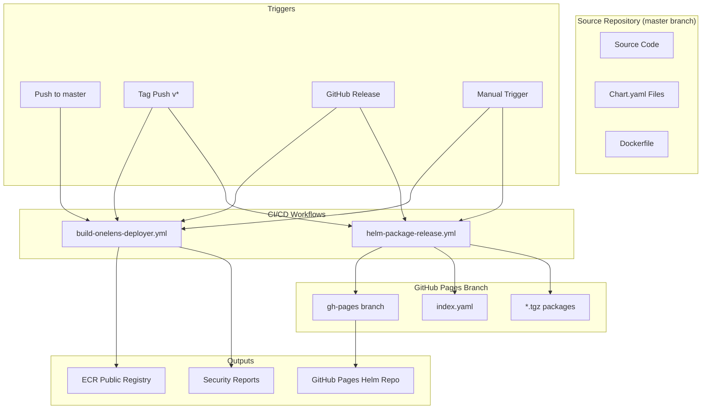

# CI/CD Architecture Documentation

This document describes the new CI/CD architecture for the OneLens Installation Scripts repository, which provides automated Docker image building and Helm chart packaging for client-facing releases.

## Table of Contents

- [Overview](#overview)
- [Architecture](#architecture)
- [Workflows](#workflows)
- [Triggers and Events](#triggers-and-events)
- [Version Management](#version-management)
- [Security](#security)
- [Usage Guide](#usage-guide)
- [Troubleshooting](#troubleshooting)

## Overview

The CI/CD system is designed to:
- **Automate Docker image builds** for the `onelens-deployer` component
- **Package and release Helm charts** with proper versioning
- **Maintain a GitHub Pages-hosted Helm repository**
- **Ensure security compliance** through vulnerability scanning
- **Support multiple release types** (latest, release candidates, production releases)

### Key Principles

1. **Separation of Concerns**: Docker builds and Helm packaging are handled by separate workflows
2. **Version Consistency**: Automated validation ensures Git tags match Chart.yaml versions
3. **Security First**: All Docker images undergo Trivy vulnerability scanning
4. **Pull Request Workflow**: All Helm repository updates go through PR review process
5. **Multiple Trigger Support**: Manual, tag-based, and release-based triggers

## Architecture



## Workflows

### 1. Docker Image Building (`build-onelens-deployer.yml`)

**Purpose**: Builds and publishes multi-architecture Docker images for the `onelens-deployer` component.

**Key Features**:
- Multi-architecture builds (linux/amd64, linux/arm64)
- Trivy security scanning with SARIF upload
- AWS ECR Public registry publishing
- GitHub Actions caching for faster builds

**Jobs**:
1. **determine-tag**: Calculates the appropriate Docker tag based on trigger type
2. **build-for-scan**: Builds image for security scanning
3. **security-scan**: Runs Trivy vulnerability scanner
4. **build-and-push**: Builds and pushes final multi-arch image

### 2. Helm Chart Packaging (`helm-package-release.yml`)

**Purpose**: Packages Helm charts and manages the GitHub Pages-hosted Helm repository.

**Key Features**:
- Version validation against Chart.yaml files
- Release candidate and production versioning
- Automated PR creation to gh-pages branch
- Dependency management with ECR authentication

**Jobs**:
1. **validate-and-determine-version**: Validates versions and determines chart version
2. **package-charts**: Packages charts and creates PR to gh-pages

## Triggers and Events

### Docker Image Building Triggers

| Trigger Type | Event | Docker Tag | Use Case |
|--------------|-------|------------|----------|
| Push to master | `push: branches: [master]` | `latest` | Development builds |
| Tag push | `push: tags: [v*]` | `v1.2.3` | Tagged releases |
| GitHub Release | `release: types: [published]` | `v1.2.3` | Production releases |
| Manual | `workflow_dispatch` | User input | On-demand builds |

### Helm Chart Packaging Triggers

| Trigger Type | Event | Chart Version | Use Case |
|--------------|-------|---------------|----------|
| Tag push | `push: tags: [v*]` | `1.2.3-rc` | Release candidates |
| GitHub Release | `release: types: [published]` | `1.2.3` | Production releases |
| Manual | `workflow_dispatch` | `{input}-rc` | Testing/validation |

## Version Management

### Docker Images

- **Latest**: `latest` tag for master branch commits
- **Tagged**: Exact Git tag (e.g., `v1.2.3` becomes `v1.2.3`)
- **Release**: Exact release tag (e.g., release `v1.2.3` becomes `v1.2.3`)

### Helm Charts

- **Release Candidates**: Git tag with `-rc` suffix (e.g., `v1.2.3` becomes `1.2.3-rc`)
- **Production**: Exact version without prefix (e.g., release `v1.2.3` becomes `1.2.3`)

### Version Validation

The system validates that:
1. Git tag version matches `charts/onelens-agent/Chart.yaml` version
2. Git tag version matches `charts/onelensdeployer/Chart.yaml` version
3. If validation fails, the pipeline stops with an error

## Security

### Vulnerability Scanning

All Docker images undergo security scanning using Trivy:

- **Severity Levels**: CRITICAL and HIGH vulnerabilities are checked
- **Reporting**: Results uploaded to GitHub Security tab as SARIF
- **Blocking**: Builds fail if critical/high vulnerabilities are found
- **Formats**: Both SARIF (for GitHub) and table (for console) outputs

### Access Control

- **AWS ECR**: Uses OIDC authentication for secure registry access
- **GitHub Pages**: Automated through GitHub Actions with appropriate permissions
- **Security Events**: Write permissions for SARIF upload to Security tab

## Usage Guide

### For Developers

#### Creating a Release Candidate

1. **Update Chart versions** in both `Chart.yaml` files to match your intended tag
2. **Push a tag**:
   ```bash
   git tag v1.2.3
   git push origin v1.2.3
   ```
3. **Monitor workflows** in GitHub Actions tab
4. **Review and merge** the auto-created PR to gh-pages branch

#### Creating a Production Release

1. **Ensure tag exists** with proper Chart.yaml versions
2. **Create GitHub Release** from the tag
3. **Monitor workflows** in GitHub Actions tab
4. **Review and merge** the auto-created PR to gh-pages branch

#### Manual Testing

1. **Go to Actions tab** → Select workflow → "Run workflow"
2. **Enter tag** (e.g., `v1.2.3` or `1.2.3`)
3. **Monitor execution** and review results

### For DevOps/Administrators

#### Repository Setup

1. **Configure AWS credentials** as repository secrets:
   - `AWS_REGION`
   - OIDC role for ECR access

2. **Ensure gh-pages branch** exists and is configured for GitHub Pages

3. **Set up branch protection** rules as needed

#### Monitoring

- **GitHub Actions**: Monitor workflow runs and failures
- **Security Tab**: Review Trivy scan results
- **Pull Requests**: Review auto-created Helm repository updates
- **GitHub Pages**: Verify Helm repository accessibility

## Troubleshooting

### Common Issues

#### Version Mismatch Error

**Error**: `Tag version (1.2.3) does not match chart version (1.2.2)`

**Solution**: 
1. Update Chart.yaml files to match the Git tag version
2. Commit changes before pushing the tag

#### Docker Build Failure

**Error**: Trivy scan fails with vulnerabilities

**Solution**:
1. Review security scan results in GitHub Security tab
2. Update base images or dependencies to resolve vulnerabilities
3. Re-run the workflow after fixes

#### Helm Package Failure

**Error**: PR creation fails or charts not packaged

**Solution**:
1. Check ECR authentication and dependency resolution
2. Verify gh-pages branch exists and is accessible
3. Review workflow logs for specific errors

#### Manual Trigger Issues

**Error**: Manual workflow doesn't start or fails

**Solution**:
1. Ensure you have write permissions to the repository
2. Check that Chart.yaml versions match your input tag
3. Verify the tag format (with or without 'v' prefix)

### Debugging Tips

1. **Check workflow logs**: Each job provides detailed output
2. **Review PR descriptions**: Auto-created PRs contain detailed information
3. **Validate versions locally**: Use `yq` to check Chart.yaml versions
4. **Test Helm repository**: Use `helm repo add` to test accessibility

### Support

For issues with:
- **CI/CD workflows**: Check GitHub Actions logs and this documentation
- **Security scanning**: Review GitHub Security tab for detailed reports
- **Helm repository**: Verify GitHub Pages configuration and index.yaml
- **Version conflicts**: Ensure Git tags match Chart.yaml versions

## Migration Notes

This new CI/CD system replaces the previous complex workflow with:
- **Simplified architecture** with clear separation of concerns
- **Better security** with mandatory vulnerability scanning
- **Improved reliability** through validation and PR-based updates
- **Enhanced visibility** with detailed logging and GitHub integration

The old workflows have been moved to `.github/workflows-backup/` with `.backup` extensions for reference.
