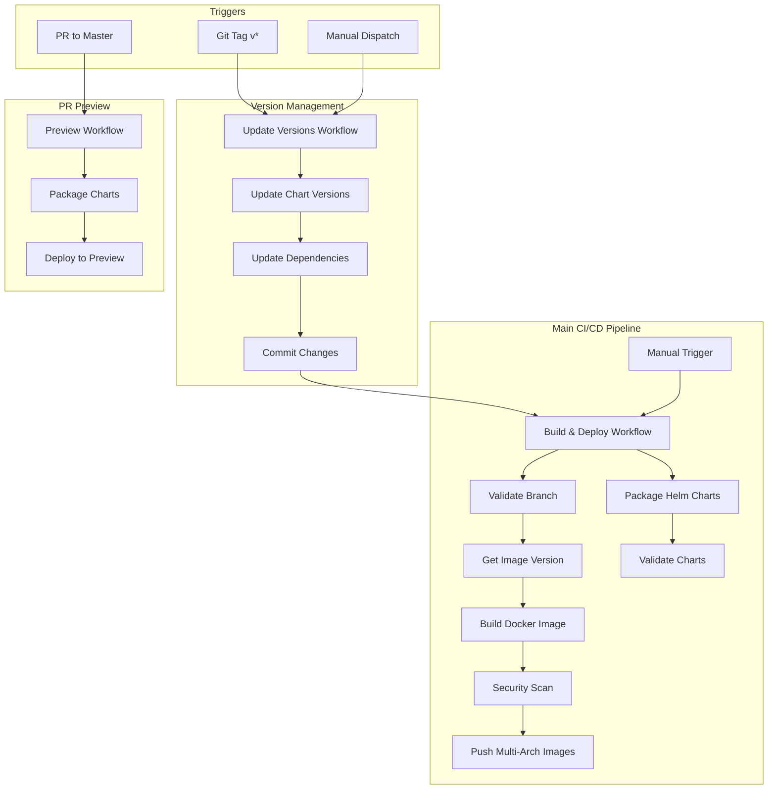
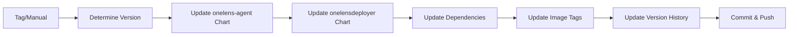
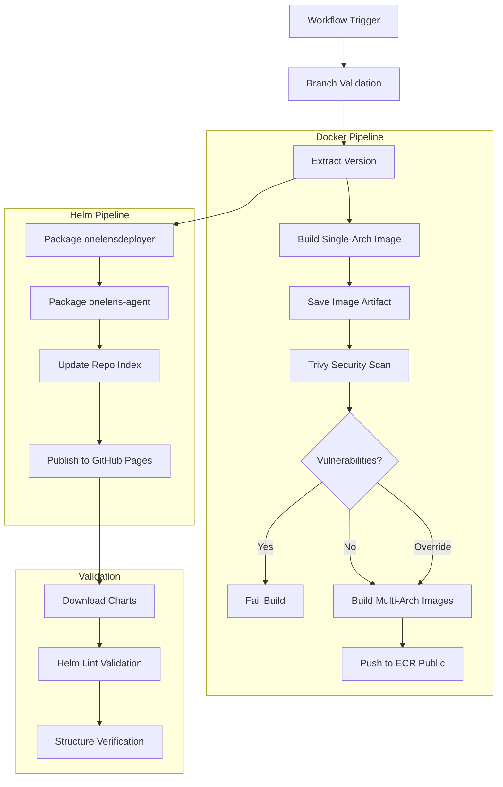
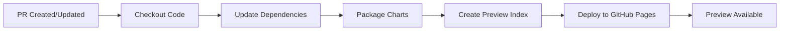
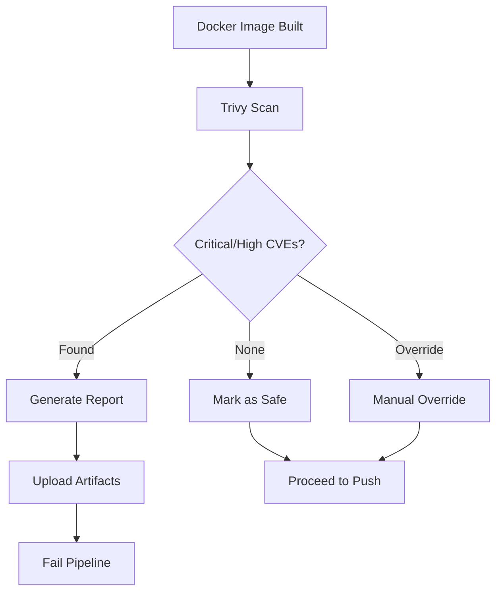
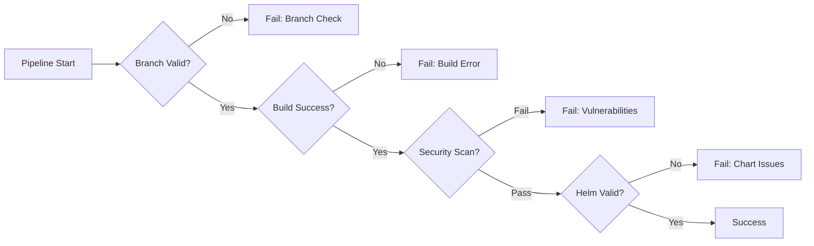

# 🔄 CI/CD Flow

This document provides a comprehensive overview of the Continuous Integration and Continuous Deployment pipeline for OneLens Installation Scripts.

## 📋 Overview

The CI/CD pipeline consists of three main GitHub Actions workflows that work together to provide automated testing, building, and deployment:

1. **Update Helm Chart Versions** - Version management
2. **Build and Deploy Pipeline** - Main CI/CD workflow  
3. **PR Preview Workflow** - Pull request validation

## 🏗️ Workflow Architecture



## 🔄 Detailed Workflow Breakdown

### 1. Update Helm Chart Versions Workflow

**Triggers:**
- Git tags matching `v*` pattern
- Manual workflow dispatch

**Purpose:** Centralized version management for all charts



**Key Operations:**
- Updates `Chart.yaml` versions and appVersions
- Synchronizes dependency versions in `Chart.lock`
- Updates Docker image tags in `values.yaml`
- Maintains version history in `version.md`
- Commits all changes to master branch

### 2. Main Build and Deploy Pipeline

**Triggers:**
- Completion of "Update Helm Chart Versions" workflow
- Manual dispatch with security override option

**Purpose:** Complete CI/CD pipeline with security scanning



**Security Features:**
- **Trivy Scanning**: Scans for CRITICAL and HIGH vulnerabilities
- **OIDC Authentication**: Secure AWS access without long-lived credentials
- **Branch Protection**: Manual triggers restricted to master branch
- **Multi-stage Validation**: Separate build and push stages

### 3. PR Preview Workflow

**Triggers:**
- Pull requests to master branch
- Changes to Dockerfile, entrypoint.sh, or chart files

**Purpose:** Provide preview deployments for testing



**Features:**
- Creates isolated preview environment per PR
- Packages both charts with PR-specific URLs
- Deploys to `preview/pr-{number}` path
- Enables testing before merge

## 🔒 Security & Quality Gates

### Security Scanning Pipeline



**Vulnerability Handling:**
- Automatic failure on CRITICAL or HIGH severity CVEs
- Detailed vulnerability reports as artifacts
- Manual override option for emergency releases
- JSON and human-readable report formats

### Quality Assurance

**Helm Chart Validation:**
- Syntax validation with `helm lint`
- Dependency verification
- Template rendering tests
- Structure and metadata validation

**Build Quality:**
- Multi-architecture support (AMD64/ARM64)
- Consistent version tagging
- Dependency caching for faster builds
- Artifact management and cleanup

## 📊 Pipeline Metrics

### Typical Execution Times

| Stage | Duration | Description |
|-------|----------|-------------|
| Version Update | 2-3 min | Chart version synchronization |
| Docker Build | 5-8 min | Multi-arch image building |
| Security Scan | 2-4 min | Trivy vulnerability scanning |
| Helm Package | 3-5 min | Chart packaging and publishing |
| Validation | 2-3 min | Chart validation and testing |
| **Total** | **14-23 min** | Complete pipeline execution |

### Resource Usage

- **Concurrent Jobs**: Up to 4 parallel jobs
- **Build Cache**: GitHub Actions cache for dependencies
- **Artifact Storage**: Temporary artifacts for cross-job communication
- **Multi-platform**: Native ARM64 and AMD64 builds

## 🚨 Failure Scenarios & Recovery

### Common Failure Points



### Recovery Procedures

**Build Failures:**
1. Check GitHub Actions logs
2. Verify Dockerfile and dependencies
3. Test locally with same Docker version
4. Retry with manual trigger if transient

**Security Scan Failures:**
1. Review vulnerability report in artifacts
2. Update base images or dependencies
3. Apply security patches
4. Use manual override only for critical hotfixes

**Helm Chart Failures:**
1. Validate chart syntax locally: `helm lint charts/chart-name`
2. Check dependency versions and availability
3. Verify template rendering: `helm template charts/chart-name`
4. Test installation in development cluster

## 🔧 Pipeline Configuration

### Environment Variables

```yaml
# Workflow-level configurations
AGENT_CHART_DIR: charts/onelens-agent
DEPLOYER_CHART_DIR: charts/onelensdeployer
```

### AWS Configuration

- **ECR Public Registry**: `public.ecr.aws/w7k6q5m9/onelens-deployer`
- **Authentication**: OIDC with IAM role assumption
- **Regions**: Primary (us-east-1), Secondary (ap-south-1)

### GitHub Integration

- **Pages Deployment**: Automatic for Helm repository
- **Artifact Management**: 90-day retention policy
- **Branch Protection**: Master branch protected

## 📈 Monitoring & Observability

### Pipeline Monitoring

- **GitHub Actions Dashboard**: Real-time pipeline status
- **Workflow Notifications**: Email alerts on failures
- **Artifact Tracking**: Build artifacts and reports
- **Performance Metrics**: Build time and success rates

### Log Analysis

```bash
# Key log locations in GitHub Actions:
# - Build logs: Docker build output and errors
# - Security logs: Trivy scan results and vulnerability details
# - Helm logs: Chart packaging and validation output
# - Deployment logs: AWS ECR and GitHub Pages publishing
```
