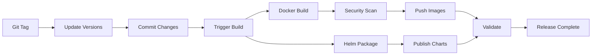

# 📖 Release Process

This document outlines the process for creating new releases of OneLens Installation Scripts.

## 🔄 Overview

The release process is automated through GitHub Actions and follows semantic versioning. There are two ways to trigger a release:

1. **Git Tags** (Recommended): Push a version tag to automatically trigger the release
2. **Manual Trigger**: Use GitHub Actions workflow dispatch for custom releases

## 🏷️ Version Strategy

We follow [Semantic Versioning](https://semver.org/) (SemVer):

- **Major (X.0.0)**: Breaking changes, major feature releases
- **Minor (X.Y.0)**: New features, backward compatible
- **Patch (X.Y.Z)**: Bug fixes, patches

## 🚀 Release Steps

### Method 1: Git Tag Release (Recommended)

1. **Ensure Clean State**
   ```bash
   git checkout master
   git pull origin master
   ```

2. **Create and Push Version Tag**
   ```bash
   # For version 1.3.0
   git tag v1.3.0
   git push origin v1.3.0
   ```

3. **Automatic Process**
   - `update-versions.yaml` workflow triggers automatically
   - Updates chart versions and dependencies
   - Commits changes to master branch
   - Triggers main CI/CD pipeline

### Method 2: Manual Release

1. **Navigate to GitHub Actions**
   - Go to repository → Actions → "Update Helm Chart Versions"

2. **Run Workflow**
   - Click "Run workflow"
   - Enter version number (e.g., `1.3.0`)
   - Click "Run workflow"

## 📋 What Happens During Release

### 1. Version Update (`update-versions.yaml`)

**OneLens Agent Chart Updates:**
- `Chart.yaml`: Updates version and appVersion
- `Chart.lock`: Updates dependency versions
- `values.yaml`: Updates image tags
- `version.md`: Adds version entry to changelog

**OneLens Deployer Chart Updates:**
- `Chart.yaml`: Updates chart version

### 2. Build & Deploy (`build-image-package-helm-validating.yaml`)

**Docker Image Pipeline:**
- Builds multi-architecture Docker images (AMD64/ARM64)
- Runs security vulnerability scanning with Trivy
- Pushes to Amazon ECR Public registry
- Tags with version number

**Helm Chart Pipeline:**
- Packages both charts (onelens-agent, onelensdeployer)
- Updates Helm repository index
- Publishes to GitHub Pages
- Validates chart integrity

### 3. Validation & Testing

**Chart Validation:**
- Downloads published charts
- Runs `helm lint` validation
- Verifies chart structure and dependencies

## 📊 Release Timeline



**Typical Timeline:**
- Version Update: ~2 minutes
- Docker Build & Scan: ~5-8 minutes
- Helm Package & Publish: ~3-5 minutes
- Total: ~10-15 minutes

## ✅ Release Checklist

### Pre-Release
- [ ] All tests passing on master branch
- [ ] Documentation updated
- [ ] Breaking changes documented
- [ ] Version number decided (following SemVer)

### During Release
- [ ] Tag created/pushed or manual workflow triggered
- [ ] Monitor GitHub Actions for successful completion
- [ ] Verify Docker images published to ECR
- [ ] Verify Helm charts available in repository

### Post-Release
- [ ] Update release notes on GitHub
- [ ] Announce release (if major/minor)
- [ ] Update dependent projects if needed
- [ ] Test installation with new version

## 🔒 Security Considerations

### Vulnerability Scanning
- All Docker images are scanned for CRITICAL and HIGH vulnerabilities
- Release fails if vulnerabilities are found
- Can be bypassed only with manual approval for urgent fixes

### Access Control
- Only maintainers can push tags
- Manual triggers restricted to master branch
- AWS ECR access through OIDC (no long-lived credentials)

## 🐛 Troubleshooting

### Common Issues

**Build Fails Due to Vulnerabilities:**
```bash
# Check vulnerability report in GitHub Actions artifacts
# Either fix vulnerabilities or use emergency override:
# GitHub Actions → Run workflow → Check "Skip vulnerability check"
```

**Helm Chart Validation Fails:**
```bash
# Usually due to:
# - Syntax errors in Chart.yaml
# - Missing dependencies
# - Invalid version format
```

**Version Update Fails:**
```bash
# Check if:
# - Tag format is correct (v1.2.3)
# - No conflicts in master branch
# - yq syntax is valid
```

### Emergency Procedures

**Hotfix Release:**
1. Create hotfix branch from master
2. Apply minimal fix
3. Merge to master
4. Create patch version tag immediately

**Rollback Release:**
1. Create new tag with previous version
2. Previous charts remain available in Helm repo
3. Users can downgrade manually if needed

## 📞 Getting Help

For release-related issues:
- Check GitHub Actions logs
- Review workflow files in `.github/workflows/`
- Contact maintainers for access issues
- Open issue for process improvements

## 📝 Version History

All version history is tracked in:
- [OneLens Agent Versions](../charts/onelens-agent/version.md)
- [GitHub Releases](https://github.com/astuto-ai/onelens-installation-scripts/releases)
- Git tags in repository 